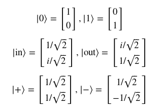
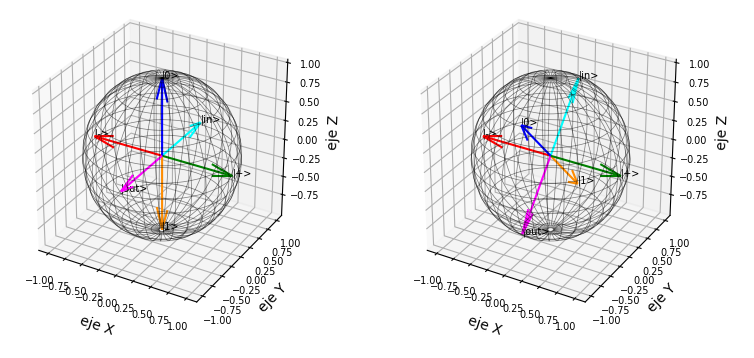

# actividad-Bloch

### 1. Importación de librerías

```python
from mpl_toolkits.mplot3d import Axes3D
import matplotlib.pyplot as plt
import numpy as np
%matplotlib notebook  # Para interactuar con las gráficas  
```
### 2. Cómo graficar una esfera, un punto, una flecha y cómo hacer una etiqueta

```python
fig = plt.figure()
ax = fig.add_subplot(111, projection='3d')

phi, theta = np.mgrid[0 : 2 * np.pi : 0.1, 0 : np.pi : 0.1]  # Equivale a hacer un doble for

# Para pasar de coordenadas esféricas (phi, theta) a coordenadas cartesianas (x, y, z):

x = np.cos(phi) * np.sin(theta)
y = np.sin(phi) * np.sin(theta)
z = np.cos(theta)

# Para graficar la esfera (estructura de alambre):

ax.plot_wireframe(x, y, z, color='yellow', rstride=2, cstride=2, linewidth=0.5, alpha=0.8)

# Para graficar un punto cualquiera en el espacio 3d, en este caso (2, -2, 1):

ax.scatter(2, -2, 1, color='red', s=10) # El valor de s modifica el grosor del punto

# Para hacer una etiqueta, en este caso sobre el punto (2, -2, 1):

ax.text(2, -2, 1, 'Punto', color='black')

# Para graficar una flecha, en este caso del origen al punto (2, -2, 1):

ax.quiver(0, 0, 0, 2, -2, 1, color='blue')

# Nombres de los ejes

ax.set_xlabel('Eje X')
ax.set_ylabel('Eje Y')
ax.set_zlabel('Eje Z')

plt.show()
```
### 3. Ejercicio de calentamiento

Grafique una esfera que representará el planeta Tierra. Grafique como puntos sobre la esfera cada una de las ciudades dadas, asegúrese de crear también una etiqueta con el nombre de la ciudad. Expanda la lista con 5 ciudades de su elección.

```python
# El formato de cada entrada de la lista es: [Nombre_Ciudad, Latitud, Longitud]

Ciudades = [
    ['Londres', 51.5, -0.1167],
    ['Bogotá', 4.5964, -74.0833],
    ['Roma', 41.8960, 12.4833],
    ['Melbourne', -37.8200, 144.9750],
    ['Nairobi', -1.2833, 36.8167],
    ['Santiago', -33.4500, -70.6670],
    ['Nueva York', 40.6943, -73.9249],
    ['Los Angeles', 34.1139, -118.4068],
    ['Moscú', 55.7522, 37.6155],
    ['Quito', -0.2150, -78.5001],
    ['Tokio', 35.6850, 139.7514],
    ['Lagos', 6.4433, 3.3915],
    ['Atenas', 37.9833, 23.7333],
    ['Belén de Pará', -1.4500, -48.4800],
    ['Budapest', 47.5000, 19.0833],
    ['Vancouver', 49.2734, -123.1216],
    ['París', 48.8667, 2.3333],
    ['Puebla', 19.0500, -98.2000]
]
```
### 4. Ejercicio *la esfera de Bloch*

Grafique una esfera. Use su función ```ket_a_Bloch``` para graficar como flechas cada uno de los siguientes kets básicos:



Además de estos 6 kets que forman los ejes de la esfera de Bloch, queremos graficar un ket cualquiera ingresado por el usuario. El resultado de este ejercicio debe concordar con la siguiente representación:


### 5. Ejercicio *visualización en la esfera de Bloch de las transformaciones de un qubit*

Declare arreglos para cada una de las transformaciones o compuertas cuánticas que se presentan en el texto guía: I, X, Y, Z, S, T, H, R(alpha), R_X(alpha), R_Y(alpha), R_Z(alpha), R_D(alpha). Grafique en paralelo dos esferas, la primera en el estado básico correpondiente al ejercicio anterior y la segunda debe estar bajo la acción de una de estas tranformaciones, según lo escoja el usuario. El resultado debe concordar con la siguiente figura:



